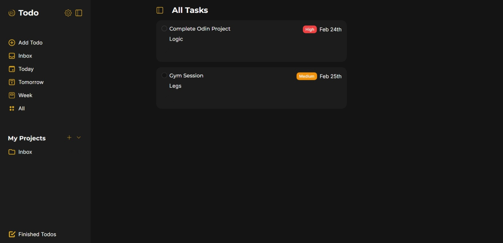

# The Odin Project - Todo List

This is a solution to the [Todo List on The Odin Project](https://www.theodinproject.com/lessons/node-path-javascript-todo-list)

## Table of contents

- [Overview](#overview)
  - [Screenshot](#screenshot)
  - [Links](#links)
- [My process](#my-process)
  - [Built with](#built-with)
  - [What I learned](#what-i-learned)
  - [Continued development](#continued-development)
- [Author](#author)
- [Acknowledgments](#acknowledgments)

## Overview

### Screenshot

### Links

- Live Site URL: [Todo List](https://niisari.github.io/todo-list/)

## My process

### Built with

- Semantic HTML5 markup
- CSS custom properties
- Flexbox
- Mobile-first workflow
- Webpack

### What I learned

- I learned few nice css tricks and few mistakes that i done in this project that i won't repeat in the next one.

### Continued development

- In future i plan to add a bit more functionality to do project, like working settings which is the cog wheel for currently not working

## Author

- Frontend Mentor - [@Yushi](https://www.frontendmentor.io/profile/Niisari)

## Acknowledgments

I took inspiration from this project made by [@S-Y-A-N], go check it out (https://s-y-a-n.github.io/todo-list/)